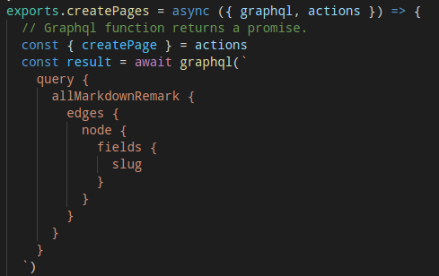

The react and node based [Gatsby](http://www.gatsbyjs.com) takes a lot of the pain and configuration away from utilizing react and react-router to create and generate multi-page 'static' websites. (In fact, the newest version of Gatsby makes use of reach-router- a router that borrows from several react-router style components)

Because Gatsby is based on React components, sites could even generate some content dynamically, say, by using an external API.

The real appeal to me, currently, is the abilty to parse markdown files into self-contained pages 'semi-dynamically'(at build time). This is great for something like this website, as I expect content updates to be relatively infrequent, but appreciate the scalability and easy of use of simply, putting a markdown file in the correct location and running `gatsby build`.

There have been plenty of resources to aid in configuring this setup, though I will say working with Gatsby's data api is daunting.

I found the [data in gatsby](https://gatsbyjs.com/tutorial/part-four) tutorial particularly helpful.

Gatsby works with its own GraphQL system, something with which I have very little familiarity- though the query language looks extremely flexible. I'm looking forward to learning more about GraphQL, maybe through the [Full Stack Open](https://fullstackopen.com/en/) course- which I have been curious about exploring for a while.

Building this website has (so far) felt fairly intuitive- I'm really looking forward to learning more about gatsby, and adding it to my tool-belt.
