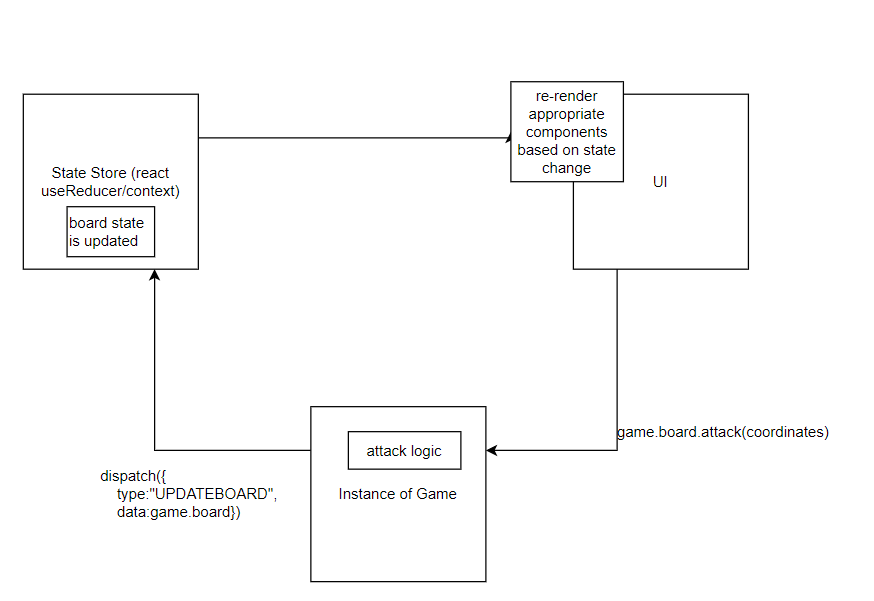

## About

This project is really just a proof of concept. The goal was to decouple 'game' logic as much as possible from UI logic in react.

Given that the premise was simple- I opted to use it as a chance to learn [typescript](https://typescriptlang.org).

I started this project after finishing my work on <Link to="/projects/battleboat" >Battleship</Link>. I was dissatisfied with my decoupling of logic there, and was unhappy with my deviation from my goals of developing with a TDD pattern.

I spent some time reconsidering the organization of my battleship implementation, while learning about the **pub/sub** / **observer** pattern.

I didn't want to redo the entire battleship application- frankly I don't even like the game, it just seemed to a good amount of logical complexity to handle in react. So I settled on implementing something simpler- but with a narrower focus on TDD and decoupling the UI from the game itself.

## Goals

- remove ALL non UI logic from React components
- utilize observer pattern
- learn typescript!
- implement better TDD practices with jest
- create a 'game' that could be implemented using different front-end frameworks,a CLI, or anything with a js runtime!

## Strategy

Game updates and logic happen in `connectFour`. `events` handles changes inside the `connectFour` instance. Using the observer pattern, react components update their state when connectFour fires `event.trigger()`.

When planning the application, I drew up this diagram to wrap my head around the logic:

## End results / Takeaways

I'm quite happy with the way this project came together. I kept the UI simple, but working with typescript, and working with the experience learned from working on battleship- made this project fly together.

Working through all the game logic through testing in Jest was _super_ effective.
