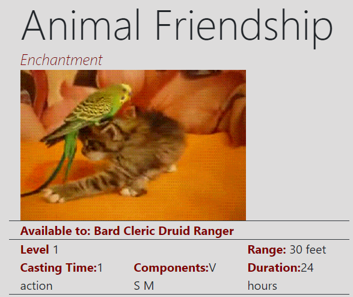

#### Note:

Wow! This project was made before I learned about react hooks!

### A simple project to practice using:

- React
- The Fetch() API
- Calls to a RESTFUL api
- Bootstrap 4

#### How it Works

Spells are sourced from the DnD5eAPI. After submission, specific information is returned from a second call to the 5e api. If the GIF option is checked- a spell will be accompanied by a _random_ Gif related to the name of the spell. At present, gifs are 3/10 times funny.

Usually its fairly unrelated. Hallucinatory terrain and Alter Self usually yield good results.

Animal friendship can be pretty good as well:

This was a fun (and helpful) project. It was also the first code I wrote while learning vim!
