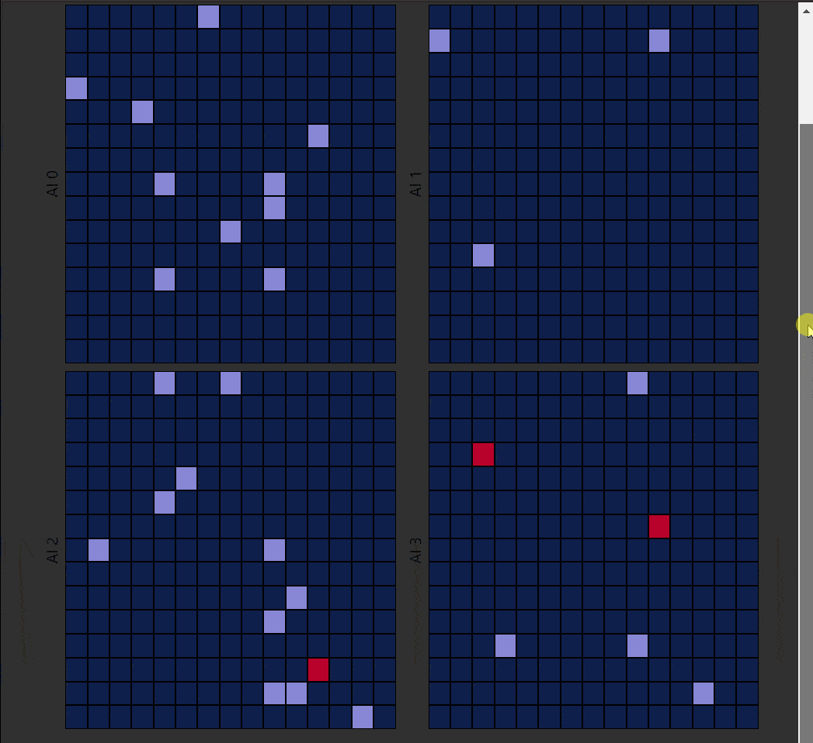

### Note

I had a lot of takeaways from this project- some of which are addressed in [(de)connect four](https://knapptr.github.io/Connect-Four)

## Focal Points/Goals:

- Styled Components
- React Hooks, particularly:
  - useContext
  - useRef
  - useCallback
  - useReducer
  - useEffect
- CSS Animations
- TDD

## Goals -cont.

I wanted to make logic in this battleship implementation be capable of handling multiple players- both human and AI. I also wanted to have an option to change board size. It worked, it was tough- but by breaking all functions down into hyper-simple utilities, testing all the logic was fairly easy.

One of my favorite parts during development, was watching 4 AI's battle it out randomly:



## Takeaways:

### React Components:

I put too many things into their own component, and there isn't a whole lot of consistency here. I found through the project some of the best ways to organize react components. It's easy to fall into the trap of putting everything into its own component. Small things don't need to be their own component!! Especially with . . .

### Styled Components:

Styled components is realllllly powerful library for working with react-components! Through building the project, I learned how powerful nesting CSS can be for getting components to look 'nice'. (I'm not making any claims that my components look nice...) If I were to start the project over again, I would organize my components differently.

### useRef,useReducer,custom hooks, useContext.

`useContext`, especially used with `useReducer` is REALLY powerful! I found, however that `useReducer` didn't exactly accomplish what I wanted it to. While it made bundling logic for the game MUCH easier, I still had to organize my data differently than what feels instinctual. This article was helpful: [Redux: Normalizing-State-Shape](https://redux.js.org/recipes/structuring-reducers/normalizing-state-shape). This is still one of my chief hangups with React, but once the data was normalized, I had a much better time with immutability. I'd be interested to check out libraries like _immer_ or _immutable.js_.

Initially I sought to use a lot of custom hooks for this project, before moving a good deal of the logic into my game reducer. I'm particularly proud of my `useAlert` hook, that allows for global access to an array of alerts.

I used useRef quite a bit, because I relied heavily on `setTimeout` for accomplishing fades (this part of the project was a nightmare!). When setting any timeout, their ID was stored in an array by reference, so that they could be cleared later if the component unmounted before the timeout was called. This actually works pretty well, as far as I can tell. It was the first time I've returned a function from a useEffect to clean up a component. But on the subject of the 'fades' I wish I would have cleaned up some custom components/hooks to accomplish the fading. I am quite proud of my `FadeSwitch` which allows for components to be faded in and out using a timeout. This component handles most of the fade logic for switching between game-states. `Turns` also contains logic for fading between player turns.

### CSS

I struggle with CSS. I'm not super happy with the overall look and layout of this, but I did do a better job than usual making it responsive. The CSS should be refactored to be a little more clean and tidy. There are a lot of components with media queries strewn throughout that really should be consolidated. This was the first time I've implemented anything with CSS animations- though I ended up using mostly transitions for the fades. I was pretty amazed at how simple CSS animations are.

### TDD

This was the impetus for this project, and I'm not particularly thrilled about how it went. I came from a mentality of wanting to create big objects that would nest all the logic of the game into their methods. Something like:

```
Game{
    Players=[Player{
        name:"player1",board:[boardArray...]
        } ]
}
```

but this strategy doesn't really work well with React. I ended up writing a bunch of small functions, testing them individually, and composing more complex functions out of them. This worked well, and I had a lot of reusable logic- but I wish I had taken a broader approach with testing. Toward the tail end of the project, I learned a lot about _React Testing Library_, and will definitely implement the component testing next time I take on a React project. I struggled writing good tests. I then went without testing for TOO LONG, trying to get workable components, that I abandoned testing. I wish I hadn't, but testing retroactively is super difficult. This was a 'teachable moment' of TDD. I understand WHY tests should be written first and foremost. Ironically, I spent the most time learning and reading through good testing material when I was wrapping this project up. Lesson learned.
