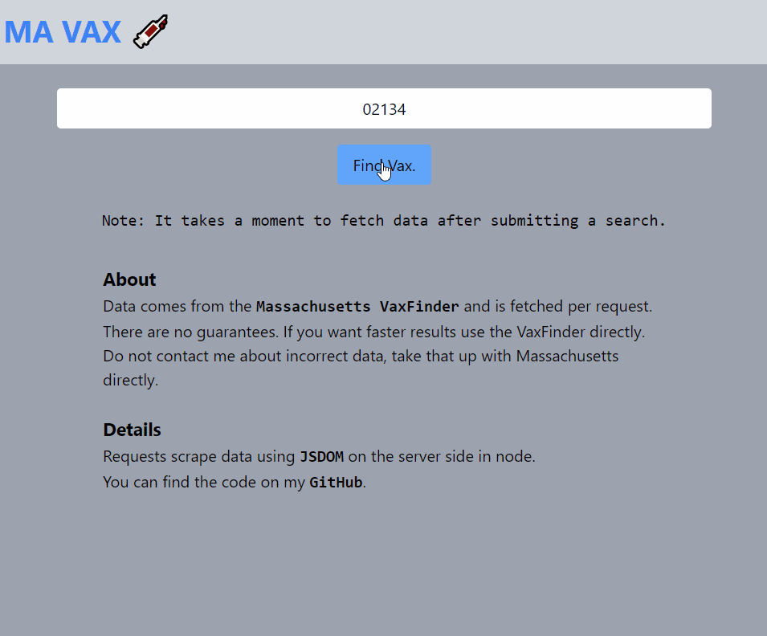

## About

This project was a quick, one-day project. I've done some web-scraping with Python and (Beautiful Soup)[https://www.crummy.com/software/BeautifulSoup/bs4/doc/]. But I was curious about using Node. The (JSDOM)[https://github.com/jsdom/jsdom] module was super easy to get using, as it implements methods available in the browser inside of Node.

## Notes

Essentially, the site is a quick 'wrapper' around the existing Massachusetts Vax finder. It is worth noting that the state's finder is pretty great, and that this project was primarily done to fiddle with deploying to heroku, and learn JSDOM.

This was a really fun project that flew together.
