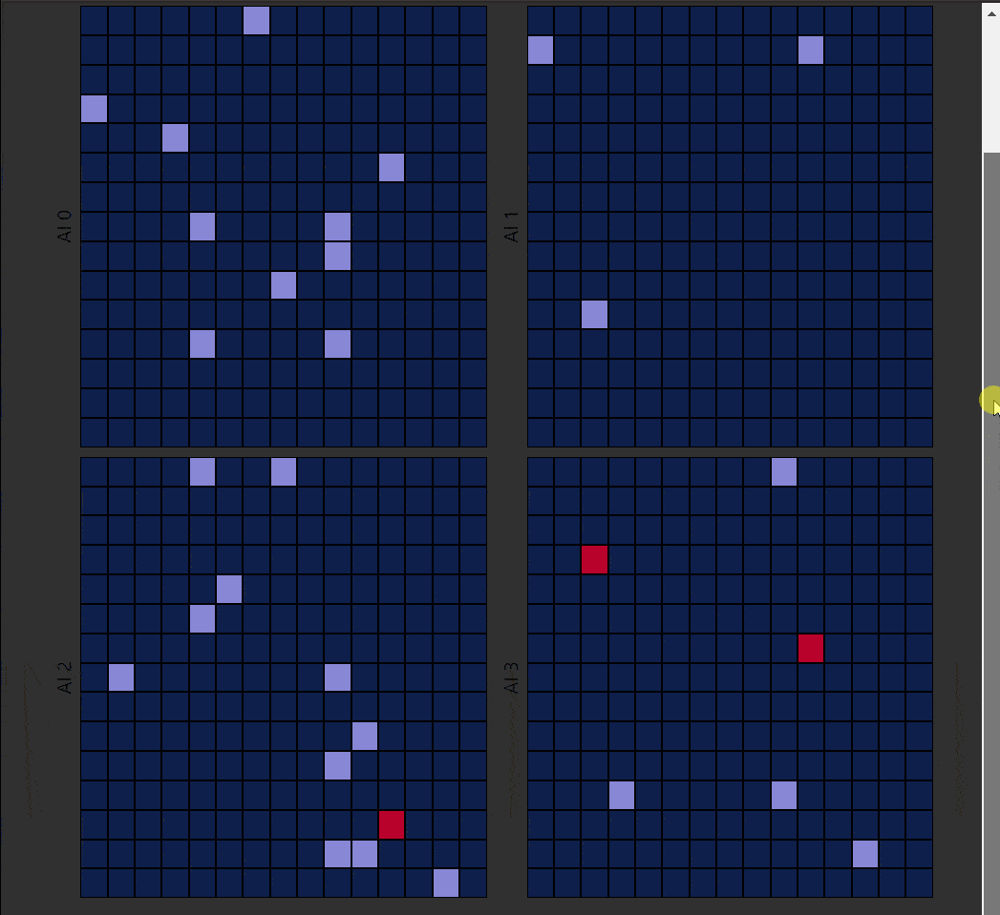

## This is the write up

- OOP
- FP
- Other words

### Thoughts

Lorem ipsum, dolor sit amet consectetur adipisicing elit. Quis veritatis ducimus doloribus cumque error tempore temporibus, nostrum eligendi optio placeat, et odio? Quibusdam nesciunt voluptate expedita illo beatae nemo vel similique neque molestias animi sunt quae perspiciatis, quia alias blanditiis aperiam voluptates excepturi. Voluptas, alias aliquam. Nesciunt inventore, voluptatum, aut recusandae doloremque nisi, alias perspiciatis excepturi velit molestiae architecto quisquam?
